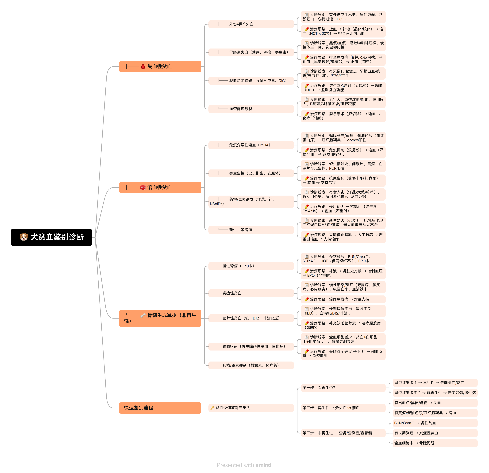
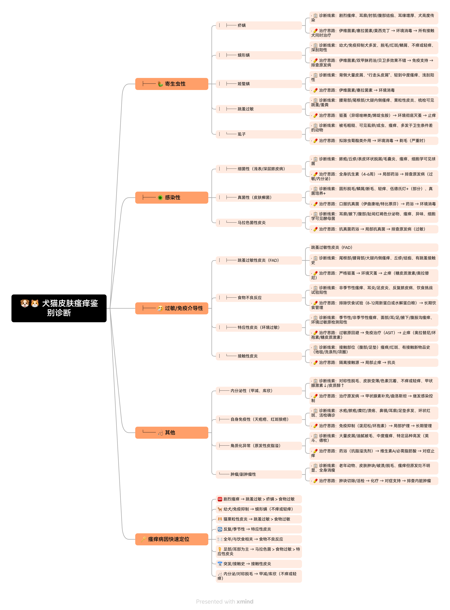
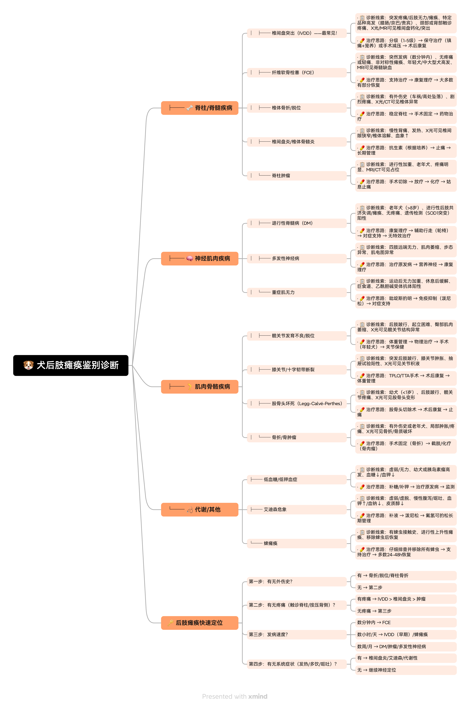
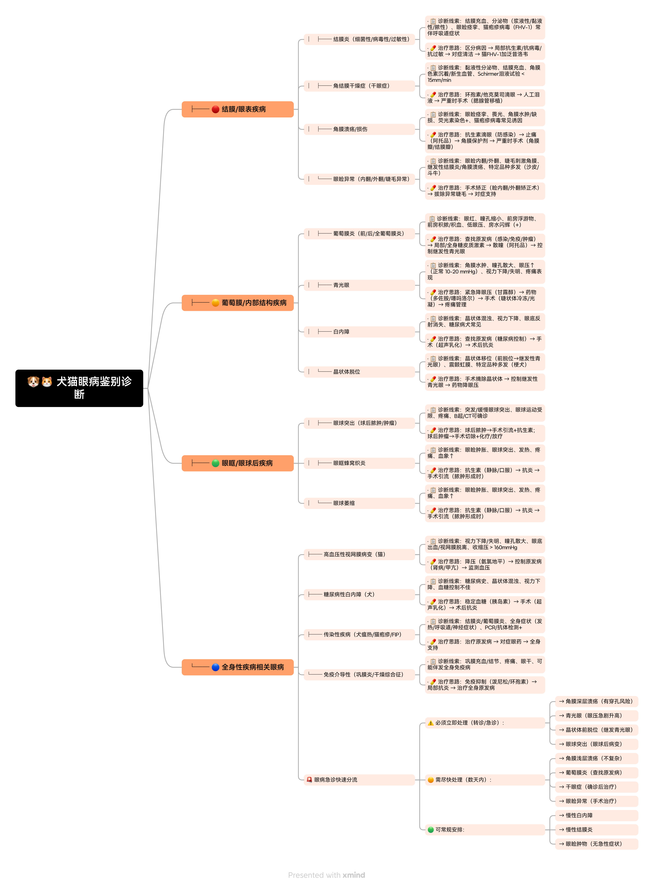
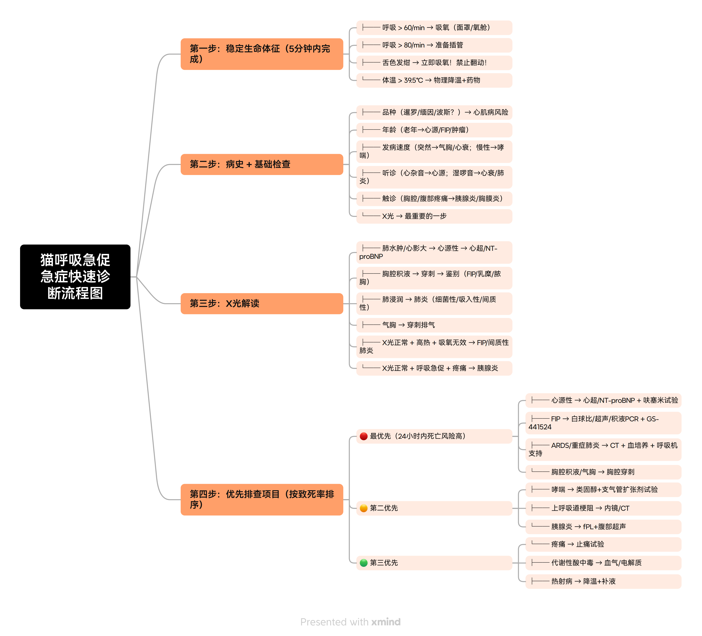

# 🐾 兽医临床决策工具库

> 执业兽医师 · 临床思维整理 | 持续更新中

## 📚 内容导航

### ✅ 已完成的工具
- [x] 犬呕吐鉴别诊断
- [x] 猫呕吐鉴别诊断
- [x] 犬腹泻鉴别诊断
- [x] 猫腹泻鉴别诊断
- [x] 犬咳嗽鉴别诊断
- [x] 猫咳嗽鉴别诊断
- [x] 猫下泌尿道疾病（FLUTD）
- [x] 犬贫血鉴别诊断
- [x] 犬猫皮肤瘙痒鉴别诊断
- [x] 犬后肢瘫痪鉴别诊断
- [x] 犬猫眼病鉴别诊断
- [x] 犬猫中毒鉴别诊断
- [x] 猫呼吸急促鉴别诊断
- [x] 临床常用药物速查

### 🚧 正在建设中的工具
- [ ] 犬猫急诊评分系统（规划中）
- [ ] 犬猫输液疗法速查（规划中）

## 🐶 犬呕吐鉴别诊断 · 临床思维导图

📄 [查看文字详解](./docs/犬呕吐诊断.md)

## 🐱 猫呕吐鉴别诊断 · 临床思维导图

📄 [查看文字详解](./docs/猫呕吐诊断.md)

## 🐶 犬腹泻鉴别诊断 · 临床思维导图

📄 [查看文字详解](./docs/犬腹泻诊断.md)

## 🐱 猫腹泻鉴别诊断 · 临床思维导图

📄 [查看文字详解](./docs/猫腹泻诊断.md)

## 🐶 犬咳嗽鉴别诊断 · 临床思维导图

📄 [查看文字详解](./docs/犬咳嗽诊断.md)

## 🐱 猫咳嗽鉴别诊断 · 临床思维导图

📄 [查看文字详解](./docs/猫咳嗽诊断.md)

## 🐱 猫下泌尿道疾病（FLUTD）· 急诊思维导图

📄 [查看文字详解](./docs/猫FLUTD.md)

> ⚠️ 急症提示：公猫超过24小时不排尿，必须立即就医。

## 🐶 犬贫血鉴别诊断 · 临床思维导图

📄 [查看文字详解](./docs/犬贫血诊断.md)

## 🐶🐱 犬猫皮肤瘙痒鉴别诊断 · 临床思维导图

📄 [查看文字详解](./docs/犬猫皮肤瘙痒诊断.md)

## 🐶 犬后肢瘫痪鉴别诊断 · 临床思维导图

📄 [查看文字详解](./docs/犬后肢瘫痪诊断.md)

> ⚠️ 急症提示：突发瘫痪伴剧烈疼痛——尤其腊肠/京巴等品种——必须立刻排查IVDD。

## 🐶🐱 犬猫眼病鉴别诊断 · 临床思维导图

📄 [查看文字详解](./docs/犬猫眼病诊断.md)

> ⚠️ 急症提示：角膜深层溃疡、急性青光眼、晶状体前脱位——需立即转诊专科。

## 🐶🐱 犬猫中毒鉴别诊断 · 临床思维导图

📄 [查看文字详解](./docs/犬猫中毒诊断.md)

> ⚠️ 急症提示：误食情况不明或已出现神经症状——禁止催吐，先稳定生命体征再问诊。

## 🐱 猫呼吸急促鉴别诊断 · 临床思维导图

📄 [查看文字详解](./docs/猫呼吸急促鉴别诊断.md)

> ⚠️ 急症提示：呼吸 > 60次/分钟立即吸氧，> 80次/分钟准备插管，一碰就发绀禁止翻动！

## 💊 临床常用药物速查（犬猫通用）

📄 [查看药物速查表](./docs/临床常用药速查犬猫通用.md)

> 📌 **使用说明**：点击导图可查看大图，点击"查看文字详解"可查看辅助检查建议、客户沟通话术和用药参考。所有内容基于临床实践整理，持续更新中。

## 🔗 快速链接

- [返回顶部](#-兽医临床决策工具库)
- [文字详解文件夹](./docs/)
- [图片文件夹](./images/)