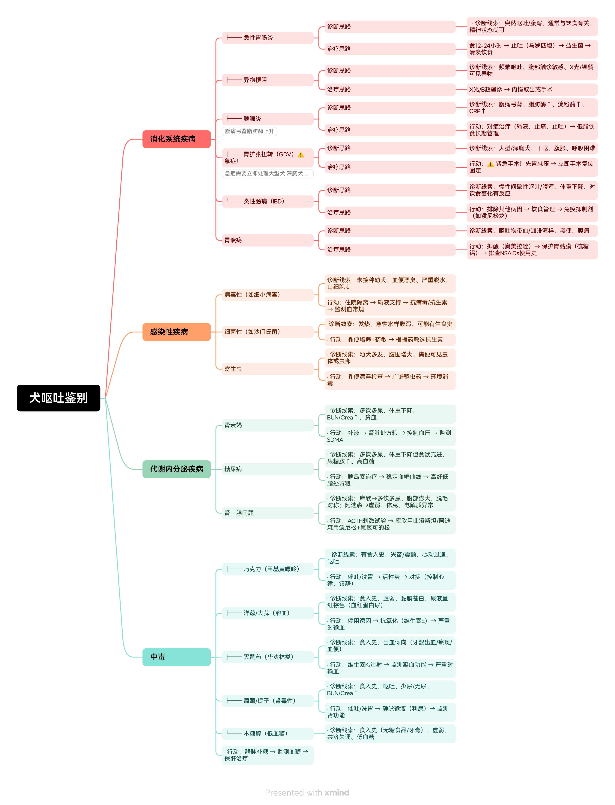
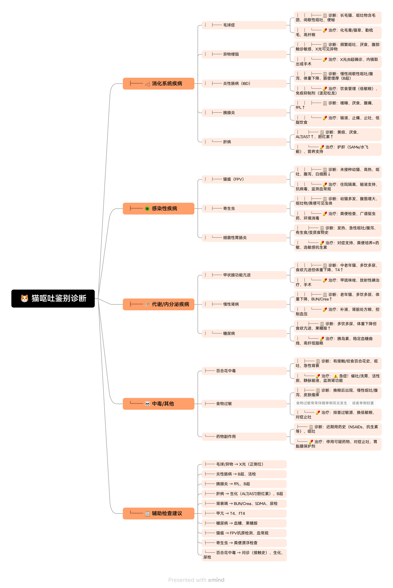
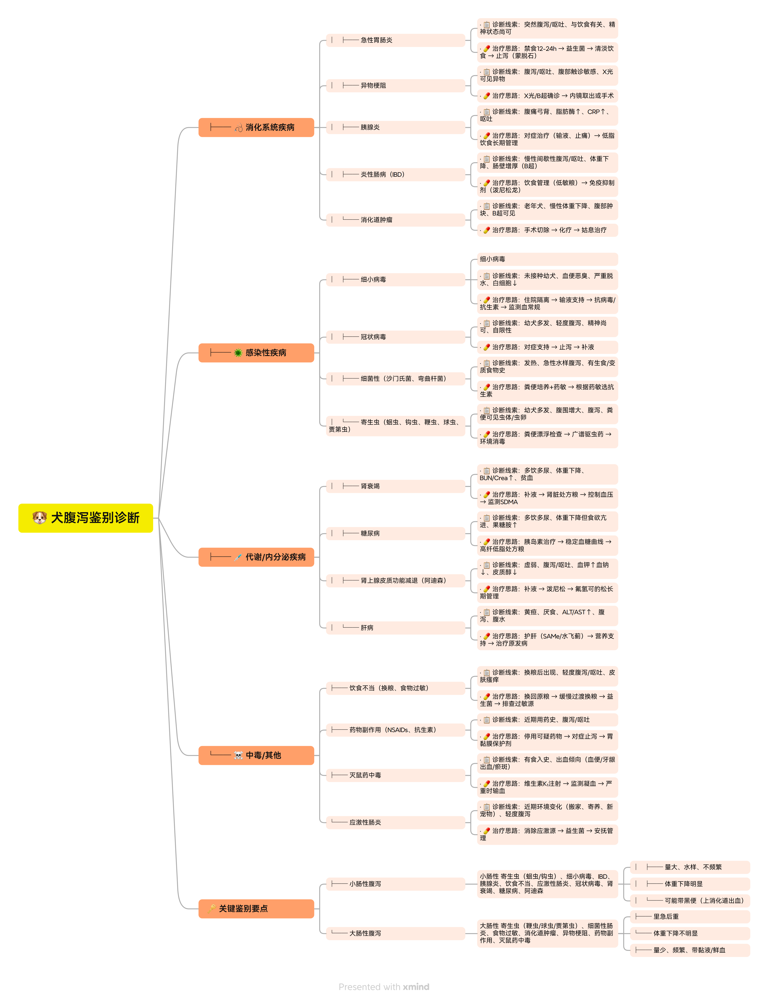
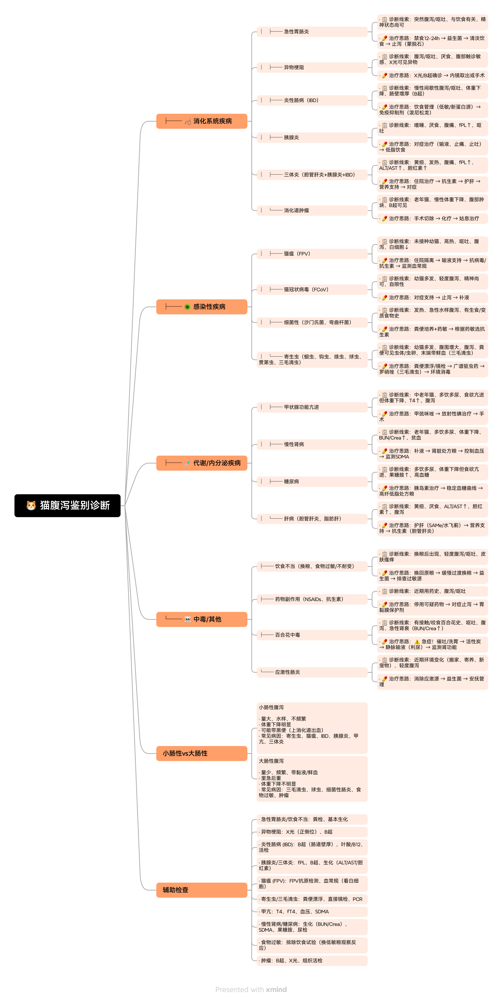
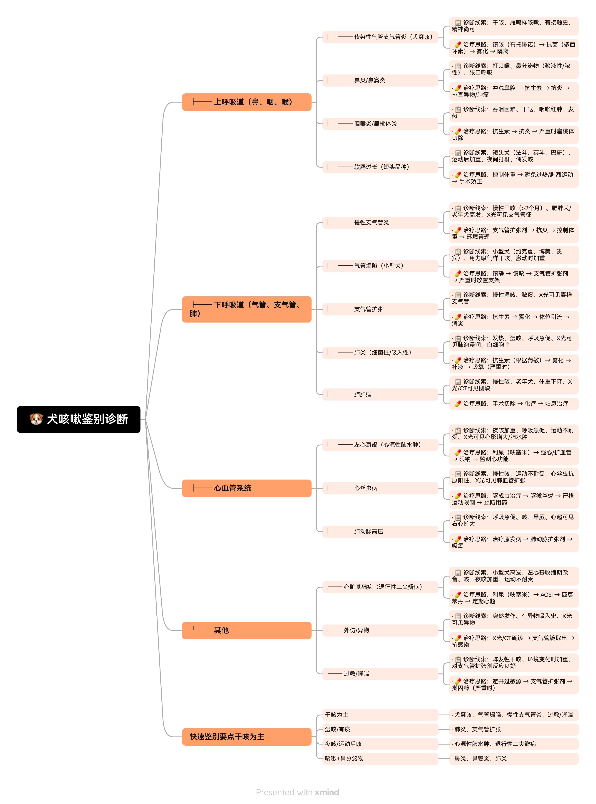
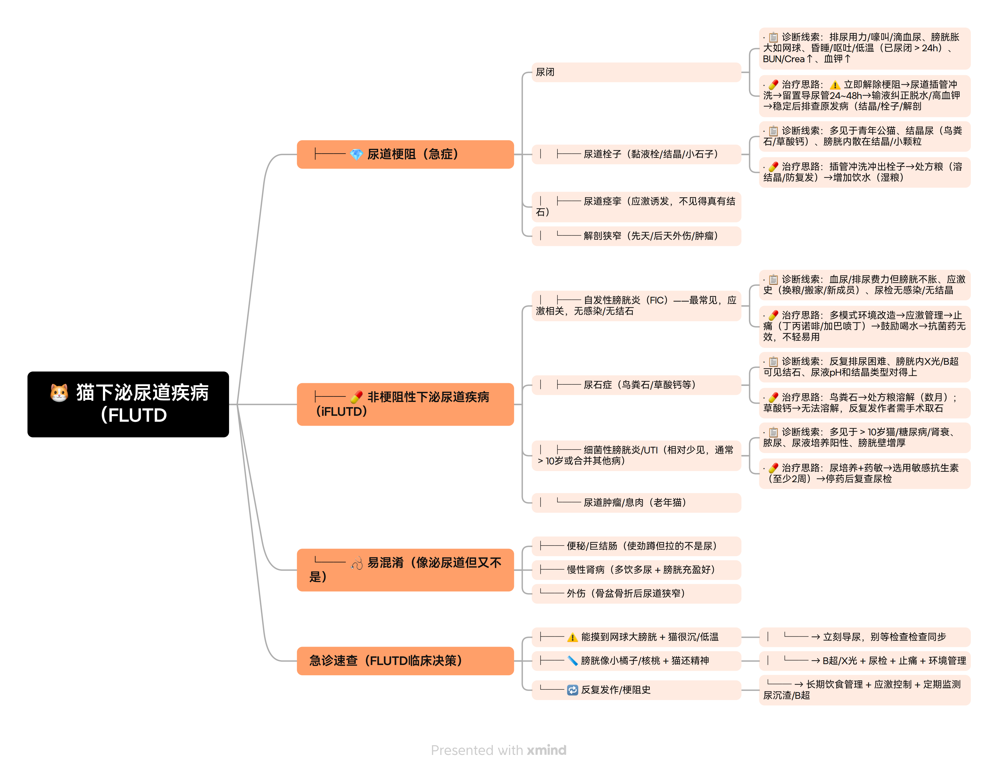

# 🐾 兽医临床决策工具库

> 执业兽医师 · 临床思维整理 | 持续更新中

---

## 📚 内容导航

### ✅ 已完成的工具
- [x] 犬呕吐鉴别诊断
- [x] 猫呕吐鉴别诊断
- [x] 犬腹泻鉴别诊断
- [x] 猫腹泻鉴别诊断
- [x] 犬咳嗽鉴别诊断
- [x] 猫咳嗽鉴别诊断
- [x] 猫下泌尿道疾病

### 🚧 正在建设中的工具

- [ ] 犬贫血鉴别诊断（规划中）
- [ ] 常用药物剂量速查表（规划中）

---

## 🐶 犬呕吐鉴别诊断 · 临床思维导图

📄 [查看文字详解](./docs/犬呕吐诊断.md)

> 更新日期：2026年9月1日

---

## 🐱 猫呕吐鉴别诊断 · 临床思维导图

📄 [查看文字详解](./docs/猫呕吐诊断.md)
> 更新日期：2026年9月2日

---

## 🐶 犬腹泻鉴别诊断 · 临床思维导图

📄 [查看文字详解](./docs/犬腹泻诊断.md)
> 更新日期：2026年9月2日

---

## 🐱 猫腹泻鉴别诊断 · 临床思维导图

📄 [查看文字详解](./docs/猫腹泻诊断.md)
> 更新日期：2026年9月2日

---

## 🐶 犬咳嗽鉴别诊断 · 临床思维导图

📄 [查看文字详解](./docs/犬咳嗽诊断.md)
> 更新日期：2026年9月3日

---
## 🐱 猫下泌尿道疾病（FLUTD）· 急诊思维导图

📄 [查看文字详解](./docs/猫下泌尿道疾病诊断.md)

> ⚠️ **急症提示**：公猫超过24小时不排尿，必须立即就医。

> 📌 **使用说明**：点击导图可查看大图，所有内容基于临床实践整理，持续更新中。
